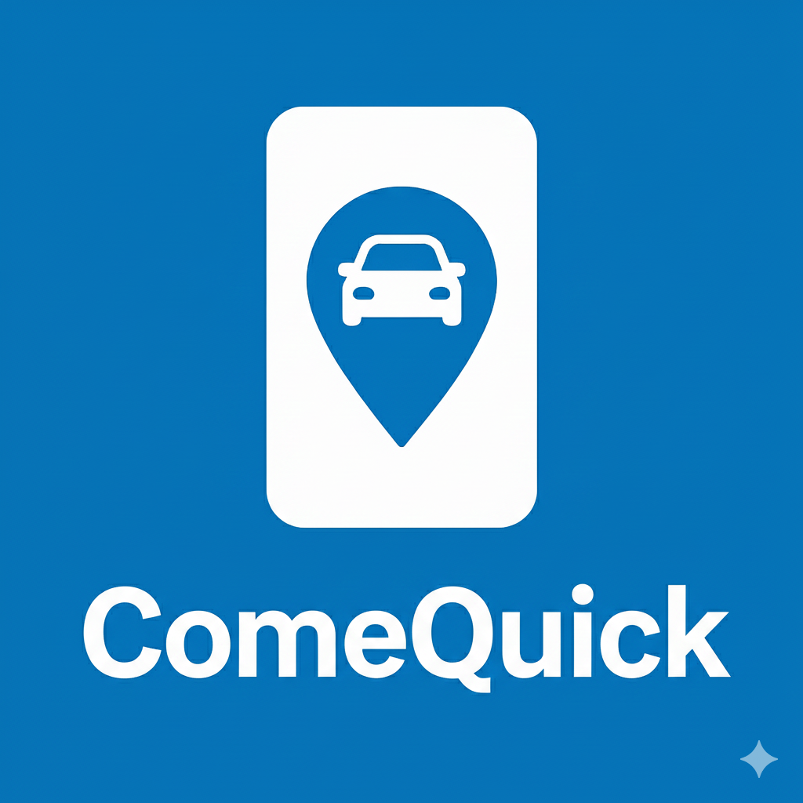

# ComeQuick - Ride-Sharing Application

<p align="center">
  
</p>

<p align="center">
  <strong>A modern ride-sharing platform connecting passengers with drivers</strong>
</p>

---

## 📋 Table of Contents

1. [Project Overview](#-project-overview)
2. [Key Features](#-key-features)
3. [Technology Stack](#-technology-stack)
4. [Project Architecture](#-project-architecture)
5. [Folder Structure](#-folder-structure)
6. [Application Flows](#-application-flows)
7. [State Management](#-state-management)
8. [Mock Services](#-mock-services)
9. [Styling & Design System](#-styling--design-system)
10. [Components](#-components)
11. [Pages & Routes](#-pages--routes)
12. [Type Definitions](#-type-definitions)
13. [Getting Started](#-getting-started)
14. [Configuration](#-configuration)
15. [Future Enhancements](#-future-enhancements)

---

## 🚀 Project Overview

**ComeQuick** is a comprehensive ride-sharing Minimum Viable Product (MVP) designed to facilitate seamless transportation connections between passengers seeking rides and drivers offering transportation services.

### What is ComeQuick?

ComeQuick is a dual-interface web application that provides:

1. **Passenger Web Application**: Allows users to request rides, track their journey, and manage their profiles
2. **Driver Web Application**: Enables drivers to scan QR codes at designated locations, view passenger requests, and accept rides
3. **Admin Panel**: Provides administrative oversight for user and driver management

The application currently operates with **mock data and local state management** to simulate real-world functionality, making it an ideal foundation for future backend integration.

### Why ComeQuick?

- **University-focused**: Initially designed for campus transportation (e.g., Ashesi University)
- **Location-based**: Uses QR code scanning to verify driver presence at pickup locations
- **Simple & Intuitive**: Clean user interface for both tech-savvy and non-technical users
- **Scalable Architecture**: Built with modern technologies for easy expansion

---

## ✨ Key Features

### For Passengers

| Feature | Description |
|---------|-------------|
| **User Registration** | Sign up with name, email, phone, and password |
| **OTP Verification** | Phone number verification via one-time password (simulated) |
| **Secure Login** | Email and password authentication |
| **Ride Request** | Request rides by selecting pickup and destination locations |
| **Real-time Matching** | Simulated driver matching with live updates |
| **Active Ride Tracking** | View matched driver details and ride status |
| **Ride History** | Access past completed rides |
| **Profile Management** | Edit personal information and upload profile pictures |
| **Dark Mode** | Toggle between light and dark themes |

### For Drivers

| Feature | Description |
|---------|-------------|
| **QR Code Scanning** | Scan location-specific QR codes to authenticate |
| **Driver Verification** | Register with vehicle and personal details |
| **Interactive Map** | View passenger request locations on a map |
| **Request List** | Browse pending passenger ride requests |
| **Accept Rides** | Accept and manage passenger pickups |
| **Profile Management** | Edit driver and vehicle information |
| **Settings** | Customize app preferences including dark mode |

### For Administrators

| Feature | Description |
|---------|-------------|
| **Secure Login** | Admin-specific authentication |
| **User Management** | View, activate/deactivate, and remove passengers |
| **Driver Management** | Verify, view, and remove drivers |
| **Dashboard Overview** | Quick statistics and management interface |

---

## 🛠 Technology Stack

### Core Technologies

| Technology | Version | Purpose |
|------------|---------|---------|
| **React** | 18.3.1 | Frontend UI library for building component-based interfaces |
| **TypeScript** | Latest | Type-safe JavaScript for better developer experience and fewer bugs |
| **Vite** | Latest | Fast build tool and development server with hot module replacement |

### Styling & UI

| Technology | Version | Purpose |
|------------|---------|---------|
| **Tailwind CSS** | Latest | Utility-first CSS framework for rapid styling |
| **shadcn/ui** | Latest | Beautiful, accessible component library built on Radix UI |
| **Radix UI** | Various | Unstyled, accessible UI primitives (dialogs, tooltips, etc.) |
| **Lucide React** | 0.462.0 | Modern icon library with 1000+ icons |
| **Framer Motion** | 10.18.0 | Animation library for smooth transitions and effects |
| **tailwindcss-animate** | 1.0.7 | Animation utilities for Tailwind CSS |

### State Management & Data

| Technology | Version | Purpose |
|------------|---------|---------|
| **Zustand** | 4.5.7 | Lightweight state management with persistence |
| **TanStack React Query** | 5.83.0 | Data fetching and caching (prepared for API integration) |
| **Zod** | 3.25.76 | Schema validation for forms and data |

### Routing & Forms

| Technology | Version | Purpose |
|------------|---------|---------|
| **React Router DOM** | 6.30.1 | Client-side routing and navigation |
| **React Hook Form** | 7.61.1 | Performant form handling with validation |
| **@hookform/resolvers** | 3.10.0 | Integration between React Hook Form and Zod |

### Maps & Location

| Technology | Version | Purpose |
|------------|---------|---------|
| **Leaflet** | 1.9.4 | Interactive map library |
| **@types/leaflet** | 1.9.21 | TypeScript definitions for Leaflet |

### Date & Time

| Technology | Version | Purpose |
|------------|---------|---------|
| **date-fns** | 3.6.0 | Modern date utility library |
| **React Day Picker** | 8.10.1 | Date picker component |

### Notifications & Feedback

| Technology | Version | Purpose |
|------------|---------|---------|
| **Sonner** | 1.7.4 | Toast notifications with a modern design |
| **Radix Toast** | 1.2.14 | Accessible toast primitives |

### Additional UI Components

| Technology | Version | Purpose |
|------------|---------|---------|
| **Embla Carousel** | 8.6.0 | Carousel/slider component |
| **CMDK** | 1.1.1 | Command menu component |
| **Input OTP** | 1.4.2 | One-time password input component |
| **Vaul** | 0.9.9 | Drawer/sheet component |
| **React Resizable Panels** | 2.1.9 | Resizable panel layouts |
| **Recharts** | 2.15.4 | Chart library for data visualization |
| **next-themes** | 0.3.0 | Theme management for dark/light modes |

---

## 🏗 Project Architecture

### High-Level Architecture

```
┌─────────────────────────────────────────────────────────────────┐
│                         ComeQuick App                          │
├─────────────────────────────────────────────────────────────────┤
│                                                                 │
│  ┌─────────────────┐  ┌─────────────────┐  ┌─────────────────┐ │
│  │   Passenger     │  │     Driver      │  │     Admin       │ │
│  │   Application   │  │   Application   │  │     Panel       │ │
│  └────────┬────────┘  └────────┬────────┘  └────────┬────────┘ │
│           │                    │                    │          │
│           └────────────────────┼────────────────────┘          │
│                                │                               │
│  ┌─────────────────────────────┴─────────────────────────────┐ │
│  │                    React Components                        │ │
│  │  (UI Components, Pages, Layouts)                          │ │
│  └─────────────────────────────┬─────────────────────────────┘ │
│                                │                               │
│  ┌─────────────────────────────┴─────────────────────────────┐ │
│  │                    State Management                        │ │
│  │  (Zustand Stores with LocalStorage Persistence)           │ │
│  └─────────────────────────────┬─────────────────────────────┘ │
│                                │                               │
│  ┌─────────────────────────────┴─────────────────────────────┐ │
│  │                    Mock Services                           │ │
│  │  (Simulated API calls with delays)                        │ │
│  └───────────────────────────────────────────────────────────┘ │
│                                                                 │
└─────────────────────────────────────────────────────────────────┘
```

### Component Architecture

```
App.tsx
├── Providers (QueryClient, BrowserRouter, TooltipProvider)
├── Theme Initialization
├── Toast Notifications (Toaster, Sonner)
└── Routes
    ├── Splash Screen (/)
    ├── Passenger Routes (/passenger/*)
    │   ├── Login
    │   ├── Signup
    │   ├── OTP Verification
    │   ├── Dashboard (Protected)
    │   ├── Request Ride (Protected)
    │   ├── Active Ride (Protected)
    │   ├── Profile (Protected)
    │   └── Settings (Protected)
    ├── Driver Routes (/driver/*)
    │   ├── Welcome
    │   ├── Map View
    │   ├── QR Scanner
    │   ├── Verification
    │   ├── Dashboard (Protected)
    │   ├── Profile (Protected)
    │   └── Settings (Protected)
    ├── Admin Routes (/admin/*)
    │   ├── Login
    │   └── Dashboard
    └── 404 Not Found
```

---

## 📁 Folder Structure

```
comequick/
├── public/                          # Static assets
│   ├── favicon.ico                  # Browser favicon
│   ├── placeholder.svg              # Placeholder image
│   └── robots.txt                   # Search engine instructions
│
├── src/                             # Source code
│   ├── assets/                      # Images and media
│   │   └── comequick-logo.png       # Application logo
│   │
│   ├── components/                  # Reusable components
│   │   ├── common/                  # Shared utility components
│   │   │   ├── LoadingSpinner.tsx   # Loading indicator
│   │   │   └── PageTransition.tsx   # Page animation wrapper
│   │   │
│   │   ├── ui/                      # shadcn/ui components
│   │   │   ├── accordion.tsx        # Expandable content
│   │   │   ├── alert.tsx            # Alert messages
│   │   │   ├── avatar.tsx           # User avatar display
│   │   │   ├── badge.tsx            # Status badges
│   │   │   ├── button.tsx           # Button component
│   │   │   ├── card.tsx             # Card container
│   │   │   ├── dialog.tsx           # Modal dialogs
│   │   │   ├── form.tsx             # Form components
│   │   │   ├── input.tsx            # Text input
│   │   │   ├── input-otp.tsx        # OTP input
│   │   │   ├── label.tsx            # Form labels
│   │   │   ├── select.tsx           # Dropdown select
│   │   │   ├── separator.tsx        # Visual divider
│   │   │   ├── sheet.tsx            # Slide-out panel
│   │   │   ├── skeleton.tsx         # Loading skeleton
│   │   │   ├── switch.tsx           # Toggle switch
│   │   │   ├── table.tsx            # Data table
│   │   │   ├── tabs.tsx             # Tab navigation
│   │   │   ├── textarea.tsx         # Multi-line input
│   │   │   ├── toast.tsx            # Toast notification
│   │   │   ├── toaster.tsx          # Toast container
│   │   │   └── tooltip.tsx          # Tooltip component
│   │   │   └── ... (40+ components) # Other UI components
│   │   │
│   │   └── NavLink.tsx              # Navigation link component
│   │
│   ├── hooks/                       # Custom React hooks
│   │   ├── use-mobile.tsx           # Mobile detection hook
│   │   └── use-toast.ts             # Toast notification hook
│   │
│   ├── lib/                         # Utility functions
│   │   └── utils.ts                 # Helper functions (cn, etc.)
│   │
│   ├── pages/                       # Page components
│   │   ├── admin/                   # Admin pages
│   │   │   ├── AdminDashboardPage.tsx
│   │   │   └── AdminLoginPage.tsx
│   │   │
│   │   ├── driver/                  # Driver pages
│   │   │   ├── DriverDashboardPage.tsx
│   │   │   ├── DriverMapPage.tsx
│   │   │   ├── DriverProfilePage.tsx
│   │   │   ├── DriverSettingsPage.tsx
│   │   │   ├── ScanQRPage.tsx
│   │   │   ├── VerifyDriverPage.tsx
│   │   │   └── WelcomePage.tsx
│   │   │
│   │   ├── passenger/               # Passenger pages
│   │   │   ├── ActiveRidePage.tsx
│   │   │   ├── DashboardPage.tsx
│   │   │   ├── LoginPage.tsx
│   │   │   ├── ProfilePage.tsx
│   │   │   ├── RequestRidePage.tsx
│   │   │   ├── SettingsPage.tsx
│   │   │   ├── SignupPage.tsx
│   │   │   └── VerifyOTPPage.tsx
│   │   │
│   │   ├── Index.tsx                # Home/landing page
│   │   ├── NotFound.tsx             # 404 error page
│   │   └── SplashScreen.tsx         # Initial loading screen
│   │
│   ├── services/                    # API/Mock services
│   │   ├── mockAuthService.ts       # Authentication simulation
│   │   ├── mockDriverService.ts     # Driver operations simulation
│   │   └── mockRideService.ts       # Ride operations simulation
│   │
│   ├── store/                       # Zustand state stores
│   │   ├── authStore.ts             # Passenger authentication state
│   │   ├── driverStore.ts           # Driver state management
│   │   └── rideStore.ts             # Ride state management
│   │
│   ├── types/                       # TypeScript type definitions
│   │   ├── auth.types.ts            # Authentication types
│   │   ├── driver.types.ts          # Driver-related types
│   │   └── ride.types.ts            # Ride-related types
│   │
│   ├── App.css                      # Global CSS (minimal)
│   ├── App.tsx                      # Main application component
│   ├── index.css                    # Tailwind directives & design tokens
│   ├── main.tsx                     # Application entry point
│   └── vite-env.d.ts                # Vite type declarations
│
├── .gitignore                       # Git ignore rules
├── components.json                  # shadcn/ui configuration
├── eslint.config.js                 # ESLint configuration
├── index.html                       # HTML entry point
├── package.json                     # Dependencies and scripts
├── postcss.config.js                # PostCSS configuration
├── README.md                        # This documentation
├── tailwind.config.ts               # Tailwind CSS configuration
├── tsconfig.json                    # TypeScript configuration
├── tsconfig.app.json                # App-specific TS config
├── tsconfig.node.json               # Node-specific TS config
└── vite.config.ts                   # Vite configuration
```

---

## 🔄 Application Flows

### Passenger Flow

```
┌──────────────┐     ┌──────────────┐     ┌──────────────┐
│   Splash     │────▶│   Welcome    │────▶│    Login     │
│   Screen     │     │    Page      │     │    Page      │
└──────────────┘     └──────────────┘     └──────┬───────┘
                                                  │
                     ┌──────────────┐             │
                     │   Signup     │◀────────────┤
                     │    Page      │             │
                     └──────┬───────┘             │
                            │                     │
                     ┌──────▼───────┐             │
                     │  OTP Verify  │             │
                     │    Page      │             │
                     └──────┬───────┘             │
                            │                     │
                            ▼                     ▼
                     ┌──────────────────────────────┐
                     │         Dashboard            │
                     │  (Request Ride, History)     │
                     └──────────────┬───────────────┘
                                    │
              ┌─────────────────────┼─────────────────────┐
              │                     │                     │
       ┌──────▼───────┐     ┌───────▼──────┐     ┌───────▼──────┐
       │   Request    │     │   Profile    │     │   Settings   │
       │    Ride      │     │    Page      │     │    Page      │
       └──────┬───────┘     └──────────────┘     └──────────────┘
              │
       ┌──────▼───────┐
       │  Finding     │
       │   Driver     │
       └──────┬───────┘
              │
       ┌──────▼───────┐
       │  Active      │
       │   Ride       │
       └──────────────┘
```

### Driver Flow

```
┌──────────────┐     ┌──────────────┐     ┌──────────────┐
│   Welcome    │────▶│   Scan QR    │────▶│   Verify     │
│    Page      │     │    Page      │     │   Driver     │
└──────────────┘     └──────────────┘     └──────┬───────┘
                                                  │
                            ┌─────────────────────┘
                            ▼
                     ┌──────────────────────────────┐
                     │         Dashboard            │
                     │  (Pending Requests, Active)  │
                     └──────────────┬───────────────┘
                                    │
              ┌─────────────────────┼─────────────────────┐
              │                     │                     │
       ┌──────▼───────┐     ┌───────▼──────┐     ┌───────▼──────┐
       │     Map      │     │   Profile    │     │   Settings   │
       │    View      │     │    Page      │     │    Page      │
       └──────────────┘     └──────────────┘     └──────────────┘
```

### Admin Flow

```
┌──────────────┐     ┌──────────────────────────────┐
│   Admin      │────▶│      Admin Dashboard         │
│   Login      │     │  (Users, Drivers, Stats)     │
└──────────────┘     └──────────────────────────────┘
```

---

## 💾 State Management

### Overview

ComeQuick uses **Zustand** for state management with the **persist middleware** to maintain state across browser sessions using **localStorage**.

### Authentication Store (`authStore.ts`)

Manages passenger authentication state.

```typescript
interface AuthStore {
  passenger: Passenger | null;        // Current logged-in passenger
  token: string | null;               // Authentication token
  isAuthenticated: boolean;           // Login status
  pendingPhone: string | null;        // Phone awaiting OTP verification
  
  // Actions
  setAuth: (passenger, token) => void;   // Set authentication
  logout: () => void;                    // Clear authentication
  updatePassenger: (passenger) => void;  // Update passenger data
  setPendingPhone: (phone) => void;      // Set phone for OTP
}
```

**Persistence Key**: `comequick-auth`

### Ride Store (`rideStore.ts`)

Manages ride requests and active rides.

```typescript
interface RideStore {
  currentRequest: RideRequest | null;  // Current pending request
  activeRide: Ride | null;             // Currently active ride
  rideHistory: Ride[];                 // Past completed rides
  
  // Actions
  setCurrentRequest: (request) => void;  // Set current request
  setActiveRide: (ride) => void;         // Set active ride
  addToHistory: (ride) => void;          // Add to ride history
  clearRide: () => void;                 // Clear current ride data
}
```

**Persistence Key**: `comequick-ride`

### Driver Store (`driverStore.ts`)

Manages driver authentication and session.

```typescript
interface DriverStore {
  driver: DriverProfile | null;        // Current driver profile
  currentRide: AcceptedRide | null;    // Active accepted ride
  sessionData: {                       // QR scan session
    sessionToken: string;
    locationId: string;
    locationName: string;
  } | null;
  
  // Actions
  setDriver: (driver) => void;           // Set driver profile
  setCurrentRide: (ride) => void;        // Set current ride
  setSessionData: (data) => void;        // Set session from QR
  logout: () => void;                    // Clear all data
}
```

**Persistence Key**: `comequick-driver`

---

## 🔧 Mock Services

The application uses three mock service modules to simulate backend functionality:

### Authentication Service (`mockAuthService.ts`)

| Function | Description | Simulated Delay |
|----------|-------------|-----------------|
| `login(credentials)` | Validates email/password and returns passenger + token | 1000ms |
| `signup(data)` | Creates new passenger, checks for duplicates | 1500ms |
| `verifyOTP(phone, otp)` | Validates OTP (accepts "123456") | 800ms |
| `getCurrentUser(token)` | Retrieves user from token | 500ms |

**Mock Credentials for Testing**:
- Email: `john@example.com`
- Password: `password123`
- OTP: `123456`

### Ride Service (`mockRideService.ts`)

| Function | Description | Simulated Delay |
|----------|-------------|-----------------|
| `createRideRequest(passengerId, data)` | Creates new ride request | 1000ms |
| `simulateDriverMatch(requestId)` | Auto-matches driver | 3-8 seconds |
| `getRideRequest(requestId)` | Fetches request details | 300ms |
| `getActiveRide(requestId)` | Gets active ride info | 300ms |
| `cancelRideRequest(requestId)` | Cancels pending request | 500ms |
| `completeRide(rideId)` | Marks ride as complete | 500ms |
| `getLocations()` | Returns available pickup locations | Instant |

**Available Locations**:
- Ashesi University Campus
- Berekuso Junction
- Adenta Barrier
- Madina Station
- Accra Mall

### Driver Service (`mockDriverService.ts`)

| Function | Description | Simulated Delay |
|----------|-------------|-----------------|
| `validateQRCode(qrCode)` | Validates location QR code | 800ms |
| `verifyDriver(sessionToken, locationId, data)` | Registers driver profile | 1000ms |
| `getPendingRequests(locationId)` | Gets pending ride requests | 500ms |
| `acceptRequest(driverId, requestId)` | Accepts a passenger request | 800ms |
| `completeRide(rideId)` | Completes the current ride | 500ms |
| `getTestQRCode()` | Returns test QR code | Instant |

**Test QR Code**: `COMEQUICK-ASHESI-001`

---

## 🎨 Styling & Design System

### Design Tokens

The design system is defined in `src/index.css` using CSS custom properties:

#### Color Palette

| Token | Light Mode | Dark Mode | Usage |
|-------|-----------|-----------|-------|
| `--primary` | `hsl(217, 91%, 40%)` | `hsl(217, 91%, 50%)` | Main brand color (ComeQuick Blue) |
| `--background` | `hsl(210, 20%, 98%)` | `hsl(222, 47%, 6%)` | Page background |
| `--foreground` | `hsl(222, 47%, 11%)` | `hsl(210, 40%, 98%)` | Primary text |
| `--card` | `hsl(0, 0%, 100%)` | `hsl(222, 47%, 8%)` | Card backgrounds |
| `--muted` | `hsl(210, 40%, 96%)` | `hsl(217, 33%, 17%)` | Subtle backgrounds |
| `--accent` | `hsl(142, 71%, 45%)` | Same | Success/accent color |
| `--destructive` | `hsl(0, 84%, 60%)` | `hsl(0, 63%, 31%)` | Error/danger actions |

#### Typography

- **Primary Font**: Plus Jakarta Sans (Google Fonts)
- **Weights Used**: 400 (Regular), 500 (Medium), 600 (Semi-bold), 700 (Bold), 800 (Extra-bold)

#### Custom Utilities

| Class | Description |
|-------|-------------|
| `.gradient-primary` | Primary brand gradient |
| `.gradient-hero` | Hero section gradient |
| `.glass` | Glassmorphism effect |
| `.hover-lift` | Lift animation on hover |
| `.shadow-glow` | Glowing shadow effect |
| `.text-gradient` | Gradient text effect |

### Tailwind Configuration

The `tailwind.config.ts` extends the default configuration with:

- **Custom Colors**: All design tokens mapped to Tailwind classes
- **Custom Animations**: fade-in, fade-out, slide-in, scale-in, float, spin-slow
- **Border Radius**: Uses `--radius` CSS variable (0.75rem default)
- **Dark Mode**: Class-based toggling (`dark` class on `html` element)

---

## 🧩 Components

### UI Components (shadcn/ui)

The project includes 40+ pre-built, accessible UI components from shadcn/ui:

| Category | Components |
|----------|------------|
| **Forms** | Input, Textarea, Select, Checkbox, Switch, Radio Group, Label, Form |
| **Feedback** | Alert, Toast, Skeleton, Progress |
| **Layout** | Card, Separator, Aspect Ratio, Resizable Panels |
| **Navigation** | Tabs, Navigation Menu, Breadcrumb, Pagination, Menubar |
| **Overlay** | Dialog, Alert Dialog, Sheet, Drawer, Popover, Tooltip, Hover Card |
| **Data Display** | Table, Badge, Avatar, Calendar |
| **Actions** | Button, Toggle, Toggle Group |
| **Other** | Accordion, Carousel, Command, Collapsible, Scroll Area |

### Custom Components

#### LoadingSpinner

A centered loading indicator used during async operations.

```tsx
<LoadingSpinner />
```

#### PageTransition

Wrapper component for smooth page transitions using Framer Motion.

```tsx
<PageTransition>
  <YourPageContent />
</PageTransition>
```

#### NavLink

Custom navigation link component with active state styling.

---

## 📄 Pages & Routes

### Route Configuration

```typescript
// Public Routes
"/"                        → SplashScreen
"/home"                    → Index (Landing Page)

// Passenger Routes (Some Protected)
"/passenger/login"         → LoginPage
"/passenger/signup"        → SignupPage
"/passenger/verify-otp"    → VerifyOTPPage
"/passenger/dashboard"     → DashboardPage (Protected)
"/passenger/request-ride"  → RequestRidePage (Protected)
"/passenger/active-ride"   → ActiveRidePage (Protected)
"/passenger/profile"       → ProfilePage (Protected)
"/passenger/settings"      → SettingsPage (Protected)

// Driver Routes (Some Protected)
"/driver"                  → WelcomePage
"/driver/map"              → DriverMapPage
"/driver/scan-qr"          → ScanQRPage
"/driver/verify"           → VerifyDriverPage
"/driver/dashboard"        → DriverDashboardPage (Protected)
"/driver/profile"          → DriverProfilePage (Protected)
"/driver/settings"         → DriverSettingsPage (Protected)

// Admin Routes
"/admin"                   → AdminLoginPage
"/admin/dashboard"         → AdminDashboardPage

// Fallback
"*"                        → NotFound (404)
```

### Protected Routes

Protected routes use wrapper components that check authentication:

```tsx
// Passenger Protection
const PassengerRoute = ({ children }) => {
  const isAuthenticated = useAuthStore((state) => state.isAuthenticated);
  return isAuthenticated ? children : <Navigate to="/passenger/login" />;
};

// Driver Protection
const DriverRoute = ({ children }) => {
  const driver = useDriverStore((state) => state.driver);
  return driver ? children : <Navigate to="/driver/scan-qr" />;
};
```

---

## 📝 Type Definitions

### Authentication Types (`auth.types.ts`)

```typescript
interface Passenger {
  id: string;
  name: string;
  email: string;
  phone: string;
  isVerified: boolean;
  createdAt: Date;
}

interface LoginCredentials {
  email: string;
  password: string;
}

interface SignupData {
  name: string;
  email: string;
  phone: string;
  password: string;
  confirmPassword: string;
}
```

### Ride Types (`ride.types.ts`)

```typescript
type RideStatus = 'pending' | 'matched' | 'in_progress' | 'completed' | 'cancelled';

interface Location {
  id: string;
  name: string;
  coordinates?: { lat: number; lng: number; };
}

interface RideRequest {
  id: string;
  passengerId: string;
  locationId: string;
  pickupLocation: string;
  destination: string;
  requestedTime: Date;
  status: RideStatus;
  createdAt: Date;
}

interface Driver {
  id: string;
  name: string;
  phone: string;
  carModel: string;
  carColor: string;
  licensePlate: string;
  rating?: number;
}

interface Ride {
  id: string;
  requestId: string;
  driver: Driver;
  status: RideStatus;
  acceptedAt: Date;
  completedAt?: Date;
}
```

### Driver Types (`driver.types.ts`)

```typescript
interface DriverProfile {
  id: string;
  name: string;
  phone: string;
  carModel: string;
  carColor: string;
  licensePlate: string;
  sessionToken: string;
  locationId: string;
  locationName: string;
  verifiedAt: Date;
}

interface DriverVerificationData {
  name: string;
  phone: string;
  carModel: string;
  carColor: string;
  licensePlate: string;
}

interface PassengerRequest {
  requestId: string;
  passengerId: string;
  passengerName: string;
  pickupLocation: string;
  destination: string;
  requestedTime: Date;
  createdAt: Date;
}
```

---

## 🚀 Getting Started

### Prerequisites

Before you begin, ensure you have the following installed:

- **Node.js** (version 18 or higher)
- **npm** (comes with Node.js) or **bun** package manager

### Installation

1. **Clone the repository**:
   ```bash
   git clone <repository-url>
   cd comequick
   ```

2. **Install dependencies**:
   ```bash
   npm install
   # or
   bun install
   ```

3. **Start the development server**:
   ```bash
   npm run dev
   # or
   bun dev
   ```

4. **Open the application**:
   Navigate to `http://localhost:5173` in your browser.

### Test Credentials

**Passenger Login**:
- Email: `john@example.com`
- Password: `password123`

**OTP Verification**:
- Code: `123456`

**Driver QR Code**:
- Use: `COMEQUICK-ASHESI-001`

**Admin Login**:
- Email: `admin@comequick.com`
- Password: `admin123`

### Available Scripts

| Command | Description |
|---------|-------------|
| `npm run dev` | Start development server |
| `npm run build` | Build for production |
| `npm run preview` | Preview production build |
| `npm run lint` | Run ESLint |

---

## ⚙️ Configuration

### Vite Configuration (`vite.config.ts`)

The project uses Vite's default configuration with:
- React plugin for JSX transformation
- Path aliases (`@/` → `./src/`)

### TypeScript Configuration

- **Strict mode enabled** for better type safety
- **Path aliases** configured for clean imports

### Tailwind Configuration

- **Dark mode**: Class-based (`darkMode: ["class"]`)
- **Content paths**: All TypeScript/TSX files in src and pages
- **Plugins**: `tailwindcss-animate` for animations

### shadcn/ui Configuration (`components.json`)

```json
{
  "style": "default",
  "rsc": false,
  "tsx": true,
  "tailwind": {
    "config": "tailwind.config.ts",
    "css": "src/index.css",
    "baseColor": "slate"
  },
  "aliases": {
    "components": "@/components",
    "utils": "@/lib/utils"
  }
}
```

---

## 🔮 Future Enhancements

### Planned Features

1. **Backend Integration**
   - Connect to real API (Supabase/Firebase)
   - Real authentication with JWT
   - Real-time updates with WebSockets

2. **Payment Integration**
   - Stripe/PayStack for ride payments
   - Wallet system for drivers and passengers

3. **Real-time Features**
   - Live driver location tracking
   - Push notifications
   - In-app messaging

4. **Enhanced Map Features**
   - Turn-by-turn navigation
   - Route optimization
   - Traffic-aware ETAs

5. **Additional Features**
   - Ride scheduling
   - Fare estimation
   - Driver ratings and reviews
   - Ride receipts and history export

6. **Mobile App**
   - React Native or PWA version
   - Offline support

---

## 📄 License

This project is private and proprietary. All rights reserved.

---

## 👥 Contributing

For internal development:

1. Create a feature branch from `main`
2. Make your changes following the existing code style
3. Test thoroughly
4. Submit a pull request for review

---

## 📞 Support

For questions or support, please contact the development team.

---

<p align="center">
  <strong>Built with ❤️ using React, TypeScript, and Tailwind CSS</strong>
</p>
